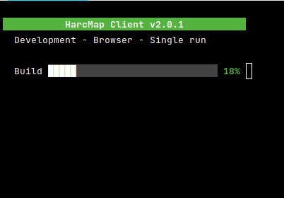
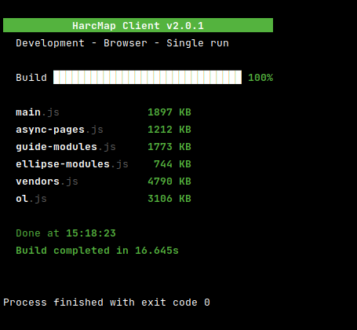
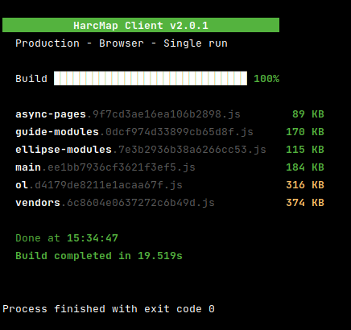
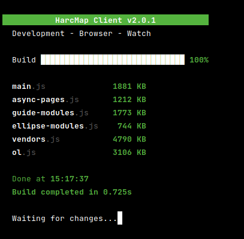
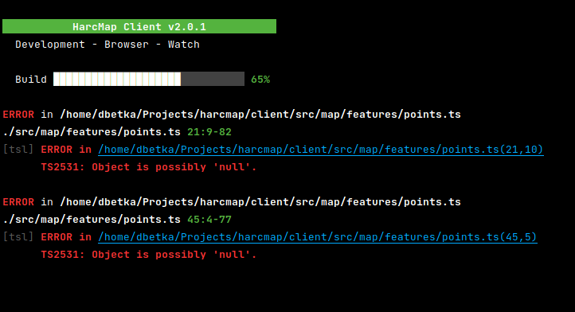
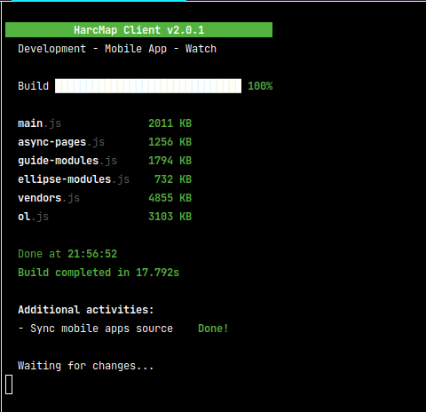

App Console Frame for Webpack
==================

[← Go back](../README.md)

>  ### Table of content:
>  * [Purpose](#purpose)
>  * [What provides](#what-provides)
>  * [Requirements for Webpack configuration](#requirements-for-webpack-configuration)
>  * [Usage examples](#usage-examples)
>  * [Available configuration](#available-configuration)
>  * [Descriptions and visualisations](#descriptions-and-visualisations)
>    + [Description of base behavior](#description-of-base-behavior)
>    + [Option `--watch` for Webpack](#option---watch-for-webpack)
>    + [Error and warning display handling](#error-and-warning-display-handling)
>    + [Running additional scripts after build process (onBuildDone)](#running-additional-scripts-after-build-process-onbuilddone)

Purpose
---------

Improve quality and appearance of build information.  
Possibility to run additional scripts after build process.

What provides
---------------

* Information what build kind and mode we chose.
* Progress-bar for build process.
* Clear list of output files with its sizes.
* Highlight in yellow for files larger than the recommended size - only for the production version.
* Possibility to run additional scripts after build process.

Requirements for Webpack configuration
----------------------------------------

* Set `stats` parameter in Webpack config like below

  ```
  stats: {
      all: false,
      errors: true,
      warnings: true,
  },
  ```

* Set `performance.maxAssetSize` to value `250000`


Usage examples
----------------

File: `client/webpack/config.common.js`

```js
module.exports = {
  mode: 'development',
  entry, // entry configuration
  stats: {
    all: false,
    errors: true,
    warnings: true,
  },
  performance: {
    maxAssetSize: 250000,
  },
  // other configurations
  plugins: [
    ...appConsoleFramePlugin({
      appName: 'HarcMap',
      appVersion: 'v1.3.2',
      target: 'Browser',
      onBuildDone: [{
        name: 'Do something',
        method: () => Promise.resolve('Info what happend!'),
        output: true,
      }]
    }),
    // Rest of plugins
  ],
};
```

Available configuration
-------------------------

| Name             | Type       | Description                                    |
|------------------|------------|------------------------------------------------|
| **appName**      | string     | Name of app display on title bar.              |
| **isClientApp?** | boolean    | Show `Client` text in title bar.               |
| **appVersion**   | string     | App version display on title bar.              |
| **target**       | string     | Target device type. Display below title bar.   |
| **onBuildDone?** | ConfigType | List of scripts running after build process.   |

```
ConfigType: [
  { 
    name: string, 
    method(): Promise<string|undefined>,
    output?: boolean,
  }
]
```


Descriptions and visualisations
----------------------------------

### Description of base behavior

After run plugin clears console and displays title bar with app name, type (`Client` or not) and version.  
Below title bar plugin displays build mode (dev or prod), target device (able to set custom in config e.g. `Browser`) and builder running mode (`Watch` or `Single run`).  
Two lines lower is displayed progress-bar for building process.



If build will be done plugin displays list of output files with extensions and sizes.



If plugin is running in production mode list of output files highlights in yellow files that exceed the recommended size.



### Option `--watch` for Webpack

Plugin detects if Webpack is running in `watch` mode or not and displays information about it below of title bar.

For option `--watch` it displays `Watch` text below title bar and `Waiting for changes…` in last line of console - example below.



If option `watch` is not used plugin displays `Single run` text - example below:


### Error and warning display handling

If while building process error or warning occurred plugin displays all information below of progress bar. Rest information (list of output files etc.) won't be display until all errors and warnings will be removed.



### Running additional scripts after build process (onBuildDone)

In plugin configuration is possibility to define list of scripts to run after build process. Each object what define script details has below options:

| Name         | Type                            | Description                                                              |
|--------------|---------------------------------|--------------------------------------------------------------------------|
| **name**     | string                          | Name of script displaying while running.                                 |
| **method()** | Promise<string&vert;undefined>  | Method to run script.                                                    |
| **output?**  | boolean                         | Option decided if plugin should display script output after done or not. |

**If any script return error or warning, plugin stops rest additional scripts queue and displays details.**



Example function for option `method`:
```js
const { exec } = require('child_process');

function runCommand (command) {
  return new Promise((resolve, reject) => {
    exec(command, (error, stdout, stderr) => {
      if (error) return reject(error.message);
      if (stderr) return reject(stderr);
      
      resolve(stdout);
    });
  });
}
```
