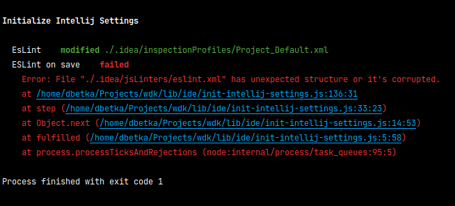

Init Intellij Settings
==================

[← Go back](../README.md)

>  ### Table of content:
>  * [Purpose](#purpose)
>  * [What provides](#what-provides)
>  * [Usage examples](#usage-examples)
>  * [Available configuration](#available-configuration)
>  * [Descriptions and visualisations](#descriptions-and-visualisations)
>    + [Description of base behavior](#description-of-base-behavior)
>    + [Error handling](#error-handling)

Purpose
---------

Automate initialization project settings process for new instances or new developers.

What provides
---------------

* Possibility to validate and modify XML files in Intellij projects configuration – `.idea` directory.
* Possibility to set default XML configuration 
* Possibility to replace XML configuration by default one

Usage examples
----------------

```js
const { initIntellijSettings } = require('@dbetka/wdk/lib/ide/init-intellij-settings');
const { getByName, modifyValueByName } = require('@dbetka/wdk/lib/ide/xml-utils');
const { defaultValidators } = require('@dbetka/wdk/lib/ide/default-validators');
const { defaultModifiers } = require('@dbetka/wdk/lib/ide/default-modifiers');

initIntellijSettings([
  {
    name: 'EsLint',
    defaultXMLPath: '../wdk/share/ide/init-intellij-settings/default/eslint.xml',
    targetXMLPath: './.idea/inspectionProfiles/Project_Default.xml',
    replaveIfExists: true,
  },
  {
    name: 'ESLint on save',
    defaultXMLPath: './ide-default/default-eslint.xml',
    targetXMLPath: './.idea/jsLinters/eslint.xml',
    validator: json => json.project !== undefined
      && json.project.component !== undefined
      && Array.isArray(getByName(json.project.component, 'EslintConfiguration').option),
    modifier: json => {
      const component = getByName(json.project.component, 'EslintConfiguration');
      modifyValueByName(component.option, 'fix-on-save', enabled);
      return json;
    },
  },
  {
    name: 'Webpack',
    defaultXMLPath: './ide-default/default-misc.xml',
    targetXMLPath: './.idea/misc.xml',
    replaceIfInvalid: true,
    validator: defaultValidators.webpack(),
    modifier: defaultModifiers.webpack(),
  },
]);

```

Available configuration
-------------------------

| Name                 | Type     | Description                                                                                 |
|----------------------|----------|---------------------------------------------------------------------------------------------|
| **name**             | string   | Name of modifying configuration.                                                            |
| **defaultXMLPath**   | string   | Path to XML file with default configuration.                                                |
| **targetXMLPath**    | string   | Path to XML file with current configuration.                                                |
| **validator**        | function | Function to validate current configuration XML file.                                        |
| **modifier**         | function | Function to modify current configuration XML file.                                          |
| **replaceIfExists**  | boolean  | If target XML file exists replace it with default one.                                      |
| **replaceIfInvalid** | boolean  | If target XML file has unexpected structure, or it's corrupted replace it with default one. |


Descriptions and visualisations
----------------------------------

### Description of base behavior

After run plugin clears console and displays title bar with plugin name.
Then displays name of modifying configuration, state of it (created, replaced, modified or failed) and modified path file if success.
It happens for each configuration being modifying.
If all configurations have been modified successfully plugin displays `All done!` message and stops.


### Error handling

If while modifying process error occurred plugin displays all information below name of modifying configuration.
After error occur plugin just stops.



